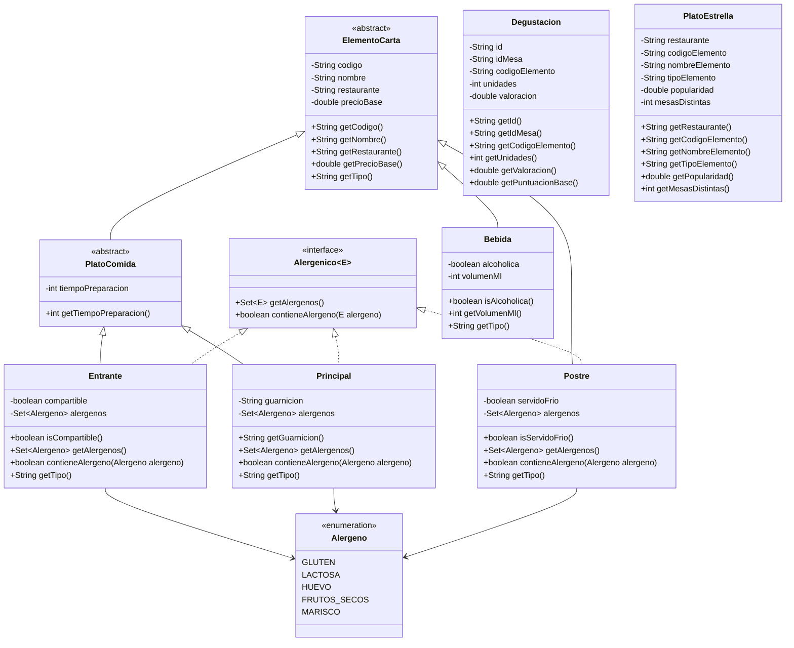
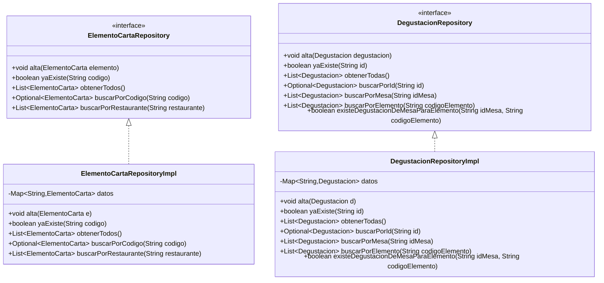
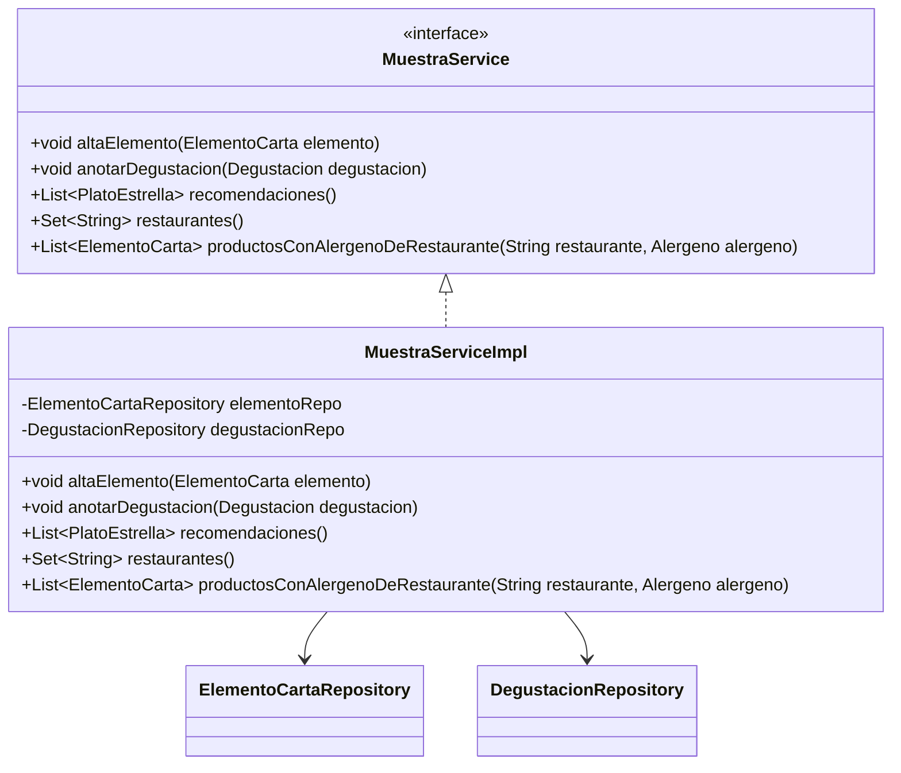

# **Examen práctico DAM1 — Programación**

---

## **Contexto**

Una empresa organiza una **Muestra Gastronómica** en la que distintos restaurantes presentan varios elementos de su carta. Durante el evento, diferentes mesas realizan **degustaciones** y se registra información sobre lo que han probado.

Se pide una aplicación Java **de consola** para:

1. **Leer** elementos de carta y degustaciones desde ficheros (CSV)
2. Dar de alta la información en memoria
3. Generar una lista con el **plato estrella** de cada restaurante
4. Realizar consultas simples relacionadas con restaurantes y alérgenos
5. **Escribir** los platos estrella a un fichero de salida

> Importante: este repositorio **no trae implementaciones**


---

## **1) Capas y paquetes**

Debes organizar el código por capas usando estos paquetes:

- es.fplumara.dam1.restaurantes.app
- es.fplumara.dam1.restaurantes.model
- es.fplumara.dam1.restaurantes.repository
- es.fplumara.dam1.restaurantes.service
- es.fplumara.dam1.restaurantes.io
- es.fplumara.dam1.restaurantes.exception

---

## **2) Diagrama de clases — Modelo**

✅ Debe existir:

- Una clase abstracta: ElementoCarta
- Una clase abstracta: PlatoComida
- Dos clases hijas de PlatoComida: Entrante y Principal
- Una clase hija directa de ElementoCarta: Postre
- Una clase hija directa de ElementoCarta: Bebida
- Una interfaz genérica Alergenico<E extends Enum<E>> implementada **solo por Entrante, Principal y Postre**
- Un enum Alergeno usado **solo por Entrante, Principal y Postre**
- Una clase Degustacion
- Una clase PlatoEstrella (DTO/record o clase normal)



### **2.1 Reglas de funcionamiento**

**Clases abstractas**

- ElementoCarta debe definirse como clase **abstracta**
- ElementoCarta debe incluir **al menos un método abstracto**:
    - String getTipo()
- PlatoComida debe definirse también como clase **abstracta**
- PlatoComida no está obligada a declarar métodos abstractos

**Alérgenos (solo para Alergenico)**

- Los tipos Entrante, Principal y Postre tendrán un conjunto (Set) de Alergeno
- Bebida **no** implementa Alergenico, no tiene alérgenos
- contieneAlergeno(...) debe devolver true si el alérgeno indicado está incluido en el conjunto del elemento

> Esta lógica debe estar en contieneAlergeno() de Entrante, Principal y Postre.

**Puntuación base por degustación (en Degustacion.getPuntuacionBase())**

- puntuacionBase = unidades * valoracion
- unidades entre **1 y 6** (incluidos)
- valoracion entre **1.0 y 5.0** (incluidos)

**Popularidad total para los platos estrella (en el Service)**

- La popularidad total de un elemento será la suma de la puntuacionBase de todas sus degustaciones registradas

---

## **3) Repositorios**

Los repositorios almacenan datos en memoria usando Map internamente.

✅ Deben existir **2 repositorios**:

- ElementoCartaRepository
- DegustacionRepository

Cada repositorio tendrá su implementación *Impl con un Map como almacenamiento.

> **Importante:** Las validaciones y reglas (duplicados, existencia, etc.) se realizan en el Service, no en el Repository




**Nota:** Optional es de java.util.Optional.

### **Qué hace cada método**

**ElementoCartaRepository**

- alta(elemento): guarda el elemento en memoria (Map)
- yaExiste(codigo): devuelve true si ya existe un elemento con ese código
- obtenerTodos(): devuelve la lista con todos los elementos de carta
- buscarPorCodigo(codigo): busca por código → Optional.empty() si no existe
- buscarPorRestaurante(restaurante): devuelve los elementos de carta de un restaurante

**DegustacionRepository**

- alta(degustacion): guarda la degustación en memoria (Map)
- yaExiste(id): devuelve true si ya existe una degustación con ese id
- obtenerTodas(): devuelve la lista con todas las degustaciones
- buscarPorId(id): busca por id → Optional.empty() si no existe
- buscarPorMesa(idMesa): devuelve las degustaciones registradas por esa mesa
- buscarPorElemento(codigoElemento): devuelve las degustaciones del elemento indicado
- existeDegustacionDeMesaParaElemento(idMesa, codigoElemento): devuelve true si esa mesa ya registró una degustación de ese elemento

---

## **4) Servicio**



### **4.1 Excepciones propias**

Crea y usa estas excepciones en ...exception:

- ElementoDuplicadoException
- ElementoNoDisponibleException
- ReglaCartaException

### **4.2 MuestraService**

- void altaElemento(ElementoCarta elemento)
- void anotarDegustacion(Degustacion degustacion)
- List<PlatoEstrella> recomendaciones()
- Set<String> restaurantes()
- List<ElementoCarta> productosConAlergenoDeRestaurante(String restaurante, Alergeno alergeno)

### **4.3 Reglas del service**

### **altaElemento(ElementoCarta elemento)**

- Si elemento es null → IllegalArgumentException
- Si codigo, nombre o restaurante son null o vacíos → IllegalArgumentException
- Si precioBase <= 0 → IllegalArgumentException
- Si ya existe un elemento con ese código → ElementoDuplicadoException

Validaciones por subtipo:

- Entrante: tiempoPreparacion > 0, conjunto de alérgenos no null
- Principal: tiempoPreparacion > 0, guarnicion no null ni vacía y conjunto de alérgenos no null
- Postre: conjunto de alérgenos no null
- Bebida: volumenMl > 0

Si todo ok → guarda

### **anotarDegustacion(Degustacion degustacion)**

- Si degustacion es null o id / idMesa / codigoElemento son null o vacíos → IllegalArgumentException
- Si unidades < 1 o unidades > 6 → IllegalArgumentException
- Si valoracion < 1.0 o valoracion > 5.0 → IllegalArgumentException
- Si ya existe una degustación con ese id → ElementoDuplicadoException
- Si el elemento no existe → ElementoNoDisponibleException
- Regla: una mesa **solo puede anotar 1 degustación por elemento**
    - Si degustacionRepo.existeDegustacionDeMesaParaElemento(idMesa, codigoElemento) → ReglaCartaException
- Si todo ok → guarda

### **recomendaciones() -> List<PlatoEstrella>**

- Recorre los elementos registrados agrupándolos por restaurante
- Para cada restaurante, estudia qué elemento debe aparecer como recomendado
- Solo pueden optar elementos con **al menos una degustación registrada**
- Para cada elemento:
    - calcula su popularidad como la suma de la puntuacionBase de todas sus degustaciones
    - calcula también el número de **mesas distintas** que lo han probado
- De cada restaurante se elige **un único elemento**, siguiendo este orden:
    1. mayor popularidad
    2. si hay empate, mayor número de mesas distintas
    3. si sigue habiendo empate, menor precioBase
    4. si sigue habiendo empate, nombre del elemento en orden alfabético
- El resultado final debe devolverse ordenado por nombre del restaurante en orden alfabético

### **restaurantes() -> Set<String>**

- Devuelve un Set<String> con los **nombres de los restaurantes** que tienen elementos de carta dados de alta
- No debe haber nombres repetidos
- Si no hay elementos registrados, devuelve un conjunto vacío

### **productosConAlergenoDeRestaurante(String restaurante, Alergeno alergeno) -> List<ElementoCarta>**

- Devuelve la lista de productos de un restaurante concreto que contienen el alérgeno indicado
- Solo deben revisarse productos Alergenico (Entrante, Principal y Postre)
- Bebida no participa en esta comprobación
- Si restaurante es null o vacío → IllegalArgumentException
- Si alergeno es null → IllegalArgumentException
- Si el restaurante no tiene productos con ese alérgeno, devuelve lista vacía

---

## **5) Lectura y escritura de ficheros (CSV) con Apache Commons CSV**

### **Entrada elementos.csv**

```csv
tipo,codigo,nombre,restaurante,precioBase,tiempoPreparacion,compartible,guarnicion,servidoFrio,alcoholica,volumenMl,alergenos
ENTRANTE,E001,Croquetas,Casa_Lola,8.5,10,true,,,,,"GLUTEN|LACTOSA"
PRINCIPAL,E002,Entrecot,Brasa_Norte,19.0,20,,Patatas_panadera,,,,""
POSTRE,E003,Tarta_de_Queso,Dulce_Vida,6.0,,,,true,,,"GLUTEN|LACTOSA|HUEVO"
BEBIDA,E004,Limonada,Casa_Lola,3.0,,,,,false,330,
```

Reglas:

- tipo debe ser exactamente: ENTRANTE, PRINCIPAL, POSTRE o BEBIDA (sin espacios)
- ENTRANTE: tiempoPreparacion, compartible y alergenos obligatorios
- PRINCIPAL: tiempoPreparacion, guarnicion y alergenos obligatorios
- POSTRE: servidoFrio y alergenos obligatorios
- BEBIDA: alcoholica y volumenMl obligatorios, y alergenos debe venir vacío
- los alérgenos vendrán separados por |
- tipo desconocido → IllegalArgumentException (o excepción propia)

### **Entrada degustaciones.csv**

```csv
id,idMesa,codigoElemento,unidades,valoracion
D001,M01,E001,2,4.5
D002,M01,E002,1,4.0
D003,M02,E003,3,5.0
D004,M03,E001,2,4.0
```

### **Salida recomendaciones.csv**

```csv
restaurante,codigoElemento,nombreElemento,tipoElemento,popularidad,mesasDistintas
Brasa_Norte,E002,Entrecot,PRINCIPAL,4.0,1
Casa_Lola,E001,Croquetas,ENTRANTE,17.0,2
Dulce_Vida,E003,Tarta_de_Queso,POSTRE,15.0,1
```

---

| **Nota**: La lectura/escritura de CSV ya está implementada en el paquete es.fplumara.dam1.restaurantes.io. El alumno solo debe transformar entre *CsvRow y su modelo de dominio.

```java
ElementoCartaCsvReader er = new ElementoCartaCsvReader();
DegustacionCsvReader dr = new DegustacionCsvReader();

List<ElementoCartaCsvRow> elementosDto = er.read("elementos.csv");
List<DegustacionCsvRow> degustacionesDto = dr.read("degustaciones.csv");

List<PlatoEstrellaCsvRow> out;
new PlatoEstrellaCsvWriter().write("recomendaciones.csv", out);
```

---

# **6) Programa principal**

En app.Main flujo simple:

Sigue las indicaciones de los comentarios para completar el contenido de es.fplumara.dam1.restaurantes.app.Main

---

## **Entrega**
- Enlace a tu fork
